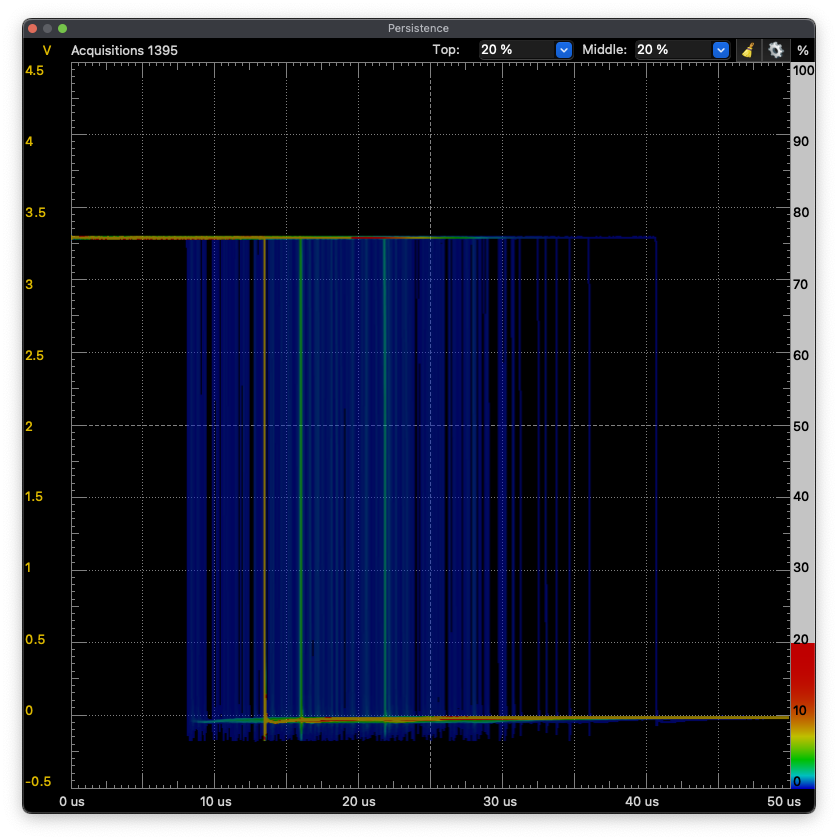
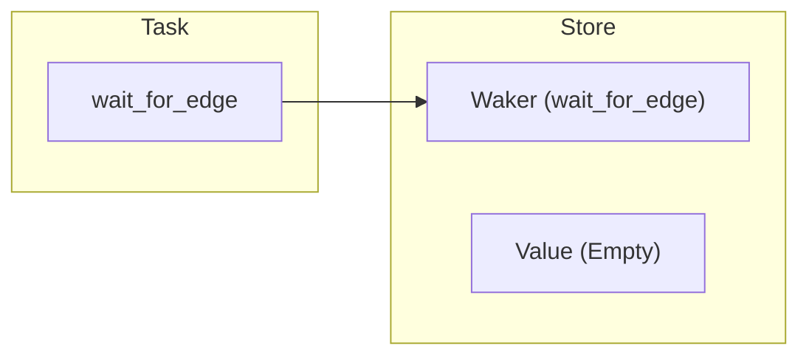
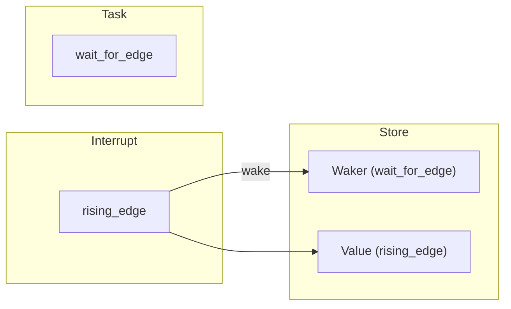
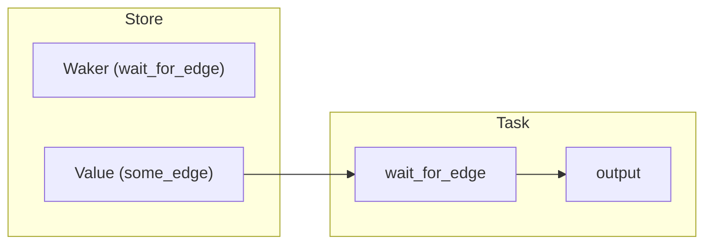

+++
title = 'Fearless But Expensive'
date = 2024-03-19
+++

Rust boasts "Fearless Concurrency" via it's async/await interface.

This interface is incomplete, but is production ready and very powerful.

In Embedded Systems contexts, the use of async as a first class citizen is tantalizing to say the least, but there's no such thing as a free lunch.

When dealing with safety critical systems, many operations are time-sensitive. Is async up to snuff?

In this post, we will explore the underlying mechanisms of async Rust on Embedded Systems, as well as the safety-relevant implications.

### Bench

- Scope: Analog Discovery 2
- MCU: STM32G031K8

## First look: Embassy

[Embassy](https://embassy.dev) is the up-and-coming embedded async ecosystem. It provides an executor, monotonics, HAL, sync utils, etc.

Let's make a program that outputs an edge mimicking an input edge, to measure the scheduling delay.

```rust
#[embassy_executor::main]
async fn main(_spawner: Spawner) {
    let p = embassy_stm32::init(Default::default());

    let mut trigger = ExtiInput::new(Input::new(p.PB1, Pull::None), p.EXTI1);
    let mut out = Output::new(p.PA15, Level::Low, Speed::VeryHigh);

    loop {
        trigger.wait_for_rising_edge().await;
        out.set_high();
        trigger.wait_for_falling_edge().await;
        out.set_low();
    }
}
```

> This simply waits for an input edge, and generates an output edge immediately after detection.

The delay was approximately **35us**.

Hence marks the beginning of our journey to minimize this time.

Let's increase the CPU clock to the maximum of 64MHz (the default is 16MHz).

```rust
#[embassy_executor::main]
async fn main(_spawner: Spawner) {
    let mut rcc_config = RccConfig::default();
    rcc_config.mux = ClockSrc::PLL(PllConfig {
        source: PllSource::HSI,
        m: Pllm::DIV1,
        n: Plln::MUL8,
        r: Pllr::DIV2, // CPU clock comes from PLLR (HSI (16MHz) / 1 * 8 / 2 = 64MHz)
        q: None,
        p: None,
    });

    let mut peripheral_config = PeripheralConfig::default();
    peripheral_config.rcc = rcc_config;

    let p = embassy_stm32::init(peripheral_config);

    let mut trigger = ExtiInput::new(Input::new(p.PB1, Pull::None), p.EXTI1);
    let mut out = Output::new(p.PA15, Level::Low, Speed::VeryHigh);

    loop {
        trigger.wait_for_rising_edge().await;
        out.set_high();
        trigger.wait_for_falling_edge().await;
        out.set_low();
    }
}
```

Now **10us**.

This is pretty much as better as would be expected.

- 64MHz / 16 Mhz = 4
- 35us / 10us = 3.5

If events being responded to are independently generated, the events can occur at a frequency of up to **50kHz** without collision. This is a good ceiling to keep in mind.

---

We can stress the executor more by introducing many background tasks that frequently bug it.

```rust
#[embassy_executor::task(pool_size = 10)]
async fn background() {
    loop {
        Timer::after_millis(1).await;
    }
}

#[embassy_executor::main]
async fn main(spawner: Spawner) {
    let mut rcc_config = RccConfig::default();
    rcc_config.mux = ClockSrc::PLL(PllConfig {
        source: PllSource::HSI,
        m: Pllm::DIV1,
        n: Plln::MUL8,
        r: Pllr::DIV2, // CPU clock comes from PLLR (HSI (16MHz) / 1 * 8 / 2 = 64MHz)
        q: None,
        p: None,
    });

    let mut peripheral_config = PeripheralConfig::default();
    peripheral_config.rcc = rcc_config;

    let p = embassy_stm32::init(peripheral_config);

    let mut trigger = ExtiInput::new(Input::new(p.PB1, Pull::None), p.EXTI1);
    let mut out = Output::new(p.PA15, Level::Low, Speed::VeryHigh);

    for _ in 0..10 {
        spawner.must_spawn(background());
    }

    loop {
        trigger.wait_for_rising_edge().await;
        out.set_high();
        trigger.wait_for_falling_edge().await;
        out.set_low();
    }
}
```



**13us-41us**

Now the delay varies quite a lot.

Since the executor is much more busy, the edge detection can be delayed significantly. More background tasks resolving just before the EXTI results in a longer wait.

> You may notice the persistence view depicts edges occurring _earlier_ than the previous test. This is likely spill-over from previous cycles and should not be considered as it is really _period+interval_. The thick orange edge indicates the true minimum delay.

The extra 3us from 10us to 13us is due to the larger scheduling logic employed by the executor since there are more tasks to poll.

## Fine-tuning: RTIC

[RTIC](https://rtic.rs/2/book/en/) is another embedded async executor with a lower-level concurrency model than Embassy.

With RTIC, some abstraction layers are peeled back, revealing more of the underlying mechanics and hardware usage. Of course, the EXTI employs an _interrupt_ to wake the core and toggle the output.

```rust
#[rtic::app(device = hal::stm32, peripherals = true)]
mod app {
    use super::*;

    #[shared]
    struct Shared {}

    #[local]
    struct Local {
        exti: stm32::EXTI,
        output: PA15<Output<PushPull>>,
    }

    #[init]
    fn init(ctx: init::Context) -> (Shared, Local) {
        let mut rcc = ctx
            .device
            .RCC
            .freeze(rcc::Config::pll().pll_cfg(rcc::PllConfig {
                mux: rcc::PLLSrc::HSI,
                m: 1,
                n: 8,
                r: 2,
                q: None,
                p: None,
            }));
        let mut exti = ctx.device.EXTI;

        let gpioa = ctx.device.GPIOA.split(&mut rcc);
        let gpiob = ctx.device.GPIOB.split(&mut rcc);

        gpiob.pb1.listen(SignalEdge::All, &mut exti);
        let output = gpioa
            .pa15
            .into_push_pull_output()
            .set_speed(Speed::VeryHigh);

        (Shared {}, Local { exti, output })
    }

    #[task(binds = EXTI0_1, local = [exti, output])]
    fn detect_edge(ctx: detect_edge::Context) {
        if ctx.local.exti.is_pending(Event::GPIO1, SignalEdge::Rising) {
            ctx.local.output.set_high().ok();
        } else if ctx.local.exti.is_pending(Event::GPIO1, SignalEdge::Falling) {
            ctx.local.output.set_low().ok();
        }

        ctx.local.exti.unpend(Event::GPIO1);
    }

    #[idle]
    fn idle(_: idle::Context) -> ! {
        loop {
            cortex_m::asm::wfi();
        }
    }
}
```

> This configures the EXTI to trigger on an edge, and binds the interrupt to a function of our implementation, which mirrors the triggering edge. No executor routing is involved.

This results in a delay of **700ns**.

This is substantially faster... for good reason. Embassy and RTIC are not doing the same thing. This is a raw interrupt binding, while Embassy used async calls to suspend a function scope and resume it when the trigger occurs. How can we do that with RTIC?

## Making it Async

To make the edge detector async with RTIC, we need to build the interaction with the RTIC executor ourself.

Let's write the top-level interface we want:

```rust
#[task(local = [edge_dispatcher, output])]
async fn our_task(ctx: our_task::Context) {
    loop {
        ctx.local.edge_dispatcher.wait_for_rising_edge().await;
        ctx.local.output.set_high().ok();
        ctx.local.edge_dispatcher.wait_for_falling_edge().await;
        ctx.local.output.set_low().ok();
    }
}
```

How do we get from an interrupt being called, to a _future_ being resolved?

First, we need to understand how async works at all.

### How Async Works

In Rust, to use async there must be an _executor_, an entity which fascilitates the scheduling and execution of "tasks"? The name for "tasks" which can be `await`ed is **Future**, which is a trait.

```rust
trait Future {
    type Output;

    fn poll(self: Pin<&mut Self>, cx: &mut Context<'_>) -> Poll<Self::Output>;
}
```

Anything that implements `Future` can be polled by the executor, and as such `await`ed.

_How does the executor know when to poll a future?_

As seen in the signature of `Future::poll`, futures are given associated _contexts_ which hold something called a `Waker`.

When `Waker::wake` is called, the executor is told to poll the corresponding future. The result of a poll can be one of two:

1. Pending
1. Ready(...)

Pending indicates the future is not ready to resolve, and Ready(...) indicates the future is _ready_ to resolve with an attached output value.

---

Ok, so it's _up to us_ to inform the executor when the time is right to poll our `wait_for_edge` futures.

We know that the EXTI interrupt is called when the edge is detected, so that is naturally the place to wake the waker.

```rust
#[task(binds = EXTI0_1, local = [exti, edge_waker], priority = 2)]
fn detect_edge(ctx: detect_edge::Context) {
    // edge_waker.wake() ?
    ctx.local.exti.unpend(Event::GPIO1);
}
```

---

Let's implement our system step by step.

There is a waker and value with managed access between the actors involved.


```rust
pub struct EdgeDetector {
    waker: CriticalSectionWakerRegistration,
    store: UnsafeCell<MaybeUninit<SignalEdge>>,
}
```

Access is granted via a _writer_ and a _reader_.

```rust
fn split(&'static self) -> (EdgeWriter, EdgeReader) {
    (
        EdgeWriter { parent: self },
        EdgeReader {
            parent: self,
            phase: WakePhase::Idle,
        },
    )
}
```

When this function is first called...

```rust
edge_reader.wait_for_rising_edge().await;
```

...the waker is registered.



```rust
pub async fn wait_for_rising_edge(&mut self) {
    poll_fn(|ctx| match self.phase {
        WakePhase::Idle => {
            self.parent.waker.register(ctx.waker());
            self.phase = WakePhase::Spawned;
            Poll::Pending
        }
        // more soon...
    })
    .await
}
```

Now that it's registered, the next time the interrupt executes, it will store the measured value and poke the executor with the waker.



```rust
pub fn update(&self, value: SignalEdge) {
    fence(Ordering::SeqCst);

    critical_section::with(|_| {
        // SAFETY: in a cs: exclusive access
        unsafe { *self.parent.store.get() = MaybeUninit::new(value) };
    });

    self.parent.waker.wake();
}
```

Then the executor polls `wait_for_edge`, the stored value is read, and the future resolves. The task continues to output.



```rust
pub async fn wait_for_rising_edge(&mut self) {
    poll_fn(|ctx| match self.phase {
        // WakePhase::Idle => {
        //     self.parent.waker.register(ctx.waker());
        //     self.phase = WakePhase::Spawned;
        //     Poll::Pending
        // }
        WakePhase::Spawned => {
            fence(Ordering::SeqCst);

            let value = critical_section::with(|_| {
                // SAFETY:
                // 1. in a cs: exclusive access
                // 2. write necessarily precedes read: the value is initialized
                unsafe { (*self.parent.store.get()).assume_init() }
            });

            if let SignalEdge::Rising = value {
                self.phase = WakePhase::Idle;
                Poll::Ready(value)
            } else {
                Poll::Pending
            }
        }
    })
    .await
}
```

---

Here is the RTIC project with this structure in use:

```rust
#[rtic::app(device = hal::stm32, peripherals = true)]
mod app {
    use super::*;

    static EDGE_DETECTOR: EdgeDetector = EdgeDetector::new();

    #[shared]
    struct Shared {}

    #[local]
    struct Local {
        exti: stm32::EXTI,
        output: PA15<Output<PushPull>>,
        edge_waker: EdgeWriter,
        edge_dispatcher: EdgeReader,
    }

    #[init]
    fn init(ctx: init::Context) -> (Shared, Local) {
        let mut rcc = ctx
            .device
            .RCC
            .freeze(rcc::Config::pll().pll_cfg(rcc::PllConfig {
                mux: rcc::PLLSrc::HSI,
                m: 1,
                n: 8,
                r: 2,
                q: None,
                p: None,
            }));
        let mut exti = ctx.device.EXTI;

        let gpioa = ctx.device.GPIOA.split(&mut rcc);
        let gpiob = ctx.device.GPIOB.split(&mut rcc);

        gpiob.pb1.listen(SignalEdge::All, &mut exti);
        let output = gpioa
            .pa15
            .into_push_pull_output()
            .set_speed(Speed::VeryHigh);

        our_task::spawn().ok();

        let (edge_waker, edge_dispatcher) = EDGE_DETECTOR.split();

        (
            Shared {},
            Local {
                exti,
                output,
                edge_waker,
                edge_dispatcher,
            },
        )
    }

    #[task(binds = EXTI0_1, local = [exti, edge_waker])]
    fn detect_edge(ctx: detect_edge::Context) {
        if ctx.local.exti.is_pending(Event::GPIO1, SignalEdge::Rising) {
            ctx.local.edge_waker.update(SignalEdge::Rising);
        } else if ctx.local.exti.is_pending(Event::GPIO1, SignalEdge::Falling) {
            ctx.local.edge_waker.update(SignalEdge::Falling);
        }

        ctx.local.exti.unpend(Event::GPIO1);
    }

    #[task(local = [edge_dispatcher, output])]
    async fn our_task(ctx: our_task::Context) {
        loop {
            ctx.local.edge_dispatcher.wait_for_rising_edge().await;
            ctx.output.set_high().ok();
            ctx.local.edge_dispatcher.wait_for_falling_edge().await;
            ctx.output.set_low().ok();
        }
    }
}
```

Now the delay is **8us**, comparable to Embassy's delay.

This makes sense because we effectively _created_ the same scheduling overhead as Embassy's HAL.

What we've accomplished can easily be generalized as a **Signal**. A message passing structure with many writers and one reader. Replace `SignalEdge` with a generic type `T` in all previous code snippets and now this structure can be used for anything.

> It's important to note that this is not equivalent to the Embassy HAL's implementation of this behavior. The interrupt is always firing whether or not we wait for it. Embassy reconfigures the EXTI for one-shot firing. With our deeper level of control, we were able to design a more appropriate structure for our use case that is slightly lower cost.

> If the rapid response time of **700ns** is an application requirement, integration with async contexts should be avoided.

## Conclusion

Embassy is just as performant as it should be for what it does, and is very convenient to get systems up and running _fast_. RTIC -- being lower level -- can involve more development time to create similar async structures to Embassy, but allows finer control of said systems to an extent that is very difficult to match with Embassy.

Nomad's interests will be better served by RTIC's transparency and flexibility.

**When emergency scenarios occur, every microsecond counts.**

---

### Use Embassy

When engaging in a rapid development cycle or are new to the Embedded field.

### Use RTIC

When safety is of utmost importance.
